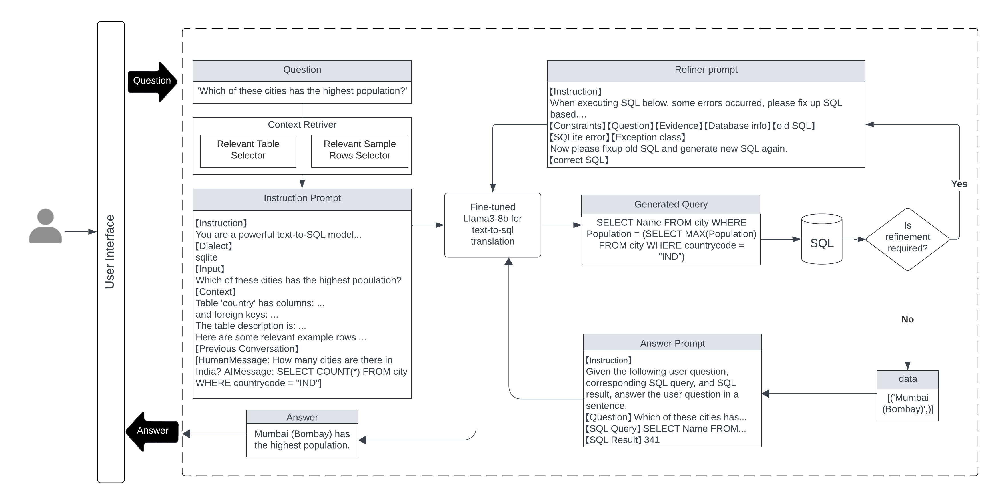
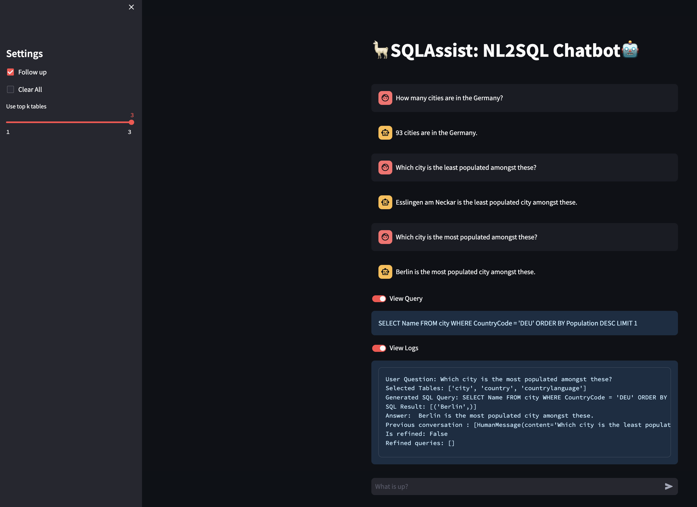

# SQLAssist: A RAG unified framework for Natural Langauge to SQL translation
Natural Language SQL Translator with following features and capabilities:

- Includes query-relevant context in instruction prompt
- Can answer follow-up questions using memory
- Refines SQL execution errors
- Rephrases answers for enhanced clarity

Full report and presentation is available at [report](report)
##
### Otto-von-Guericke-Universität Magdeburg, Germany
|Team members|
| -------- |
|Basasvaraj Hiremath|
|Dhanashree Gunda|
|Mallika Manam|
|Niharika Ramanath|
|Supriya P Upadhyaya|

|Supervisors|
| -------- |
|Dr. Marco Polignano|
|Prof. Dr.-Ing. Ernesto William De Luca|
##
### Training
For instruction fine-tune use [training notebook](SupriyaUpadhyaya/HCNLP-Text2Sql-Project/NL2SQL_Training.ipynb). 

The training and inference was performed using the FastLangaugeModel module from unsloth library which accelerates the training and inference by 2 fold. We have fine-tuned open-source Llama-3-8b model using 4 bit quantized optimized for finetuning provided by unsloth. [Clinton/Text-to-sql-v1](https://huggingface.co/datasets/Clinton/Text-to-sql-v1) dataset with 262,208 instances is used. The training was done for 100 steps with learning rate of 2e-4 and adamw-8bit optimizer with a batch size of 8. The model was finetuned for q, k,v,0,gate,up and down projection layers. The total training
parameters were 41,943,040. The training and validation loss for 100 steps of training were around 0.4 for both.

Model can be downloaded at [basavaraj/text2sql-Llama3-8b](https://huggingface.co/basavaraj/text2sql-Llama3-8b)

##
### Inference and application
For inference use [inference notebook](SupriyaUpadhyaya/HCNLP-Text2Sql-Project/NL2SQL_Inference.ipynb)
##
### SQLAssist application
Start the SQLAssist application on Google Colab using [App notebook](SupriyaUpadhyaya/HCNLP-Text2Sql-Project/NL2SQL_App.ipynb)

